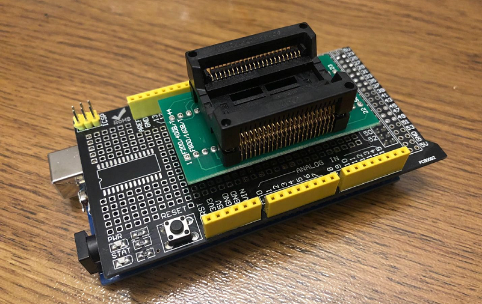

# MegaBurner Web Serial v0.5A MX29L3211

Port HTML/Web Serial de MegaBurner para programar, leer y verificar memorias **MX29L3211 32 Mbit / 4 MB / 3.3 V** usando **Arduino Mega 2560**. El objetivo del proyecto es reemplazar la aplicación de PC original basada en Java/SWT/RXTX/DLL por una interfaz web moderna, portable y ejecutable desde Chrome/Edge mediante Web Serial, conservando el enfoque de programación paralela de 16 bits del proyecto original.

> Estado recomendado del proyecto: **v0.5A**. El modo estable validado es **500000 baudios**, `pageSize=256`, `writeBlock=4096`, `readBlock=16384`, FastWrite, FastRead y FastCRC.

---

## Imágenes del MegaBurner original

Las siguientes imágenes provienen del repositorio original `maximaas/MegaBurner` y se incluyen aquí como referencia histórica y de montaje. Este proyecto conserva los créditos y la relación técnica con el trabajo original.

### Hardware original de MegaBurner



Convertir a 3.3V (https://learn.adafruit.com/arduino-tips-tricks-and-techniques/3-3v-conversion)
---

## Origen del proyecto

Este repositorio nace como una traducción y evolución de la parte de PC de **MegaBurner**. El proyecto original de Maximaas describe un programador flash basado en Arduino Mega 2560 para memorias MX29L3211. En el README original se explica que el diseño usa un adaptador SOP de 48 pines y un shield de expansión para conectar el DIP/adaptador al Arduino Mega; también se indica que inicialmente solo soporta MX29L3211 y que otros chips requerirían otro shield o cableado específico.

MegaBurner también declara que la primera etapa del hardware consiste en convertir el Mega 2560 a compatibilidad **3.3 V**, y remite a la guía de Adafruit para esa conversión. La razón es crítica: la MX29L3211 es una flash de **3.3 V** y no debe conectarse directamente a señales de 5 V sin adaptar el hardware.

El README original reconoce el uso de dos bases técnicas:

- **sanni/cartreader**, por su lógica de programación flash de 16 bits probada con MX29L3211.
- **MEEPROMMER**, por la comunicación PC ↔ Arduino Mega 2560 vía puerto serial.

Este port mantiene esa filosofía, pero reemplaza la aplicación Java de escritorio por una interfaz HTML/Web Serial.

---

## Qué aporta esta versión HTML

- Interfaz web sin Java, SWT, RXTX ni DLL.
- Compatible con Chrome/Edge mediante Web Serial.
- Firmware optimizado para Arduino Mega 2560.
- Programación rápida validada en MX29L3211.
- Lectura rápida sin reset por bloque.
- Verificación rápida mediante CRC32 calculado en Arduino.
- Interfaz en español estilo Windows XP.
- Tooltips en botones y controles.
- Manual de uso y documentación técnica.
- Pinout detallado para construir el programador.
- Carpeta de imágenes y referencias del MegaBurner original.

---

## Estructura del repositorio

```text
MegaBurner-WebSerial-MX29L3211/
├─ README.md
├─ index.html
├─ CHANGELOG.md
├─ CONTRIBUTING.md
├─ LICENSE_NOTES.md
├─ firmware/
│  ├─ current/
│  │  ├─ MegaBurner.ino
│  │  ├─ MX29L3211.cpp
│  │  └─ MX29L3211.h
│  └─ legacy/
│     ├─ MegaBurner_v0_4A_FastRead/
│     ├─ MegaBurner_v0_4B_FastWrite/
│     ├─ MegaBurner_v0_4C_FastCRC/
│     ├─ MegaBurner_v0_5A_NativePage256/
│     └─ MegaBurner_v0_5E_Final500K/
├─ web/
│  ├─ index.html
│  └─ releases/
├─ docs/
│  ├─ MANUAL_USO_ES.md
│  ├─ MODIFICACION_MEGA2560_3V3.md
│  ├─ PINOUT_MX29L3211_MEGA2560.md
│  ├─ PROTOCOLO_SERIAL.md
│  ├─ HISTORIAL_DESARROLLO.md
│  ├─ BENCHMARKS.md
│  ├─ ROADMAP.md
│  ├─ CREDITOS.md
│  └─ assets/original-megaburner/
└─ hardware/
   ├─ README.md
   └─ pinout_mx29l3211_sop44_to_mega2560.csv
```

---

## Modificación necesaria del Arduino Mega 2560

**Advertencia:** la MX29L3211 es una memoria de 3.3 V. No se recomienda conectar directamente una MX29L3211 a un Arduino Mega 2560 funcionando a 5 V. El README original de MegaBurner indica expresamente que la primera etapa es convertir el Mega2560 a compatibilidad de 3.3 V.

Opciones de implementación:

1. **Mega 2560 modificado a 3.3 V:** seguir una guía confiable de conversión a 3.3 V y validar niveles lógicos antes de conectar la memoria.
2. **Adaptación de niveles:** usar transceptores/level shifters adecuados para un bus paralelo de direcciones, datos y señales de control.
3. **Shield dedicado:** replicar el concepto original de MegaBurner: adaptador SOP/TSOP a DIP + shield de expansión hacia puertos del Mega.

### Requisitos eléctricos mínimos

- Alimentación de la MX29L3211: **3.3 V**.
- Señales del bus: compatibles con 3.3 V.
- `BYTE` debe ir a **VCC** para operar en modo 16-bit.
- `WE`, `OE` y `CE` deben ir a las líneas de control indicadas en el pinout.
- GND común entre Arduino/adaptador/memoria.
- No se soportan EPROM con VPP de 12 V en esta versión, igual que en el proyecto original.

Más detalles: [`docs/MODIFICACION_MEGA2560_3V3.md`](docs/MODIFICACION_MEGA2560_3V3.md)

---

## Pinout resumido Arduino Mega 2560 ↔ MX29L3211 SOP44

El cableado sigue la distribución descrita por MegaBurner/cartreader y los puertos completos usados por el firmware.

| MX29L3211 SOP44 | Señal | Arduino Mega 2560 | Puerto AVR |
|---:|---|---|---|
| 1 | WE | D7 | PH4 |
| 12 | CE | D9 | PH6 |
| 14 | OE | D16 | PH1 |
| 33 | BYTE | D6 / VCC 3.3 V | PH3 / HIGH |
| 11–4 | A0–A7 | A0–A7 / D54–D61 | PF0–PF7 |
| 42–35 | A8–A15 | A8–A15 / D62–D69 | PK0–PK7 |
| 34 | A16 | D49 | PL0 |
| 3 | A17 | D48 | PL1 |
| 2 | A18 | D47 | PL2 |
| 43 | A19 | D46 | PL3 |
| 44 | A20 | D45 | PL4 |
| 15,17,19,21,24,26,28,30 | Q0–Q7 | D37–D30 | PC0–PC7 |
| 16,18,20,22,25,27,29,31 | Q8–Q15 | D22–D29 | PA0–PA7 |
| 23,32 | GND | GND | GND |
| 13,38 | VCC | 3.3 V | 3.3 V |

Consulta la tabla completa con cada pin: [`docs/PINOUT_MX29L3211_MEGA2560.md`](docs/PINOUT_MX29L3211_MEGA2560.md)

---

## Uso rápido

1. Carga el firmware en `firmware/current/` en tu Arduino Mega 2560 modificado/adaptado a 3.3 V.
2. Abre `index.html` en Chrome o Edge.
3. Conecta a los mismos baudios compilados en el `.ino`.
4. Pulsa **Check ID**. Para MX29L3211 debe responder `C2F9`.
5. Carga una ROM/imagen de 4 MB o prepara una imagen a 4 MB.
6. Ejecuta **Erase**.
7. Ejecuta **Write**.
8. Ejecuta **CRC Verify rápido**.
9. Opcionalmente ejecuta **Read/Dump** y compara byte a byte.

---

## Configuración final recomendada

| Parámetro | Valor recomendado |
|---|---:|
| Baudrate | 500000 |
| Chip size | 4194304 bytes |
| Write mode | Fast |
| Write block | 4096 bytes |
| Page size | 256 bytes |
| Read block | 16384 bytes |
| Verify principal | CRC rápido |
| Verify profundo | Dump completo + comparación |
| Skip FF | Desactivado inicialmente; activar manualmente solo después de Erase OK |

---

## Protocolo serial implementado

| Comando | Descripción |
|---|---|
| `C` | Leer ID del chip |
| `E` | Borrar chip |
| `R<block>,<size>` | Leer bloque |
| `W<offset>,<page>,<size>` | Escribir bloque en modo seguro |
| `S` | Iniciar FastWrite |
| `X<offset>,<page>,<size>` | Escribir bloque en FastWrite |
| `Z` | Finalizar FastWrite |
| `K<offset>,<size>` | Calcular CRC32 de la flash desde Arduino |
| `V` | Versión/capacidades del firmware |
| `Q` | Leer status register |
| `L` | Clear status register |

---

## Mejoras implementadas frente al MegaBurner original

| Área | MegaBurner original | Port WebSerial |
|---|---|---|
| Aplicación PC | Java/SWT/RXTX/DLL | HTML + JavaScript + Web Serial |
| Portabilidad | Dependiente de Java/DLL | Navegador compatible Web Serial |
| Baudrate validado | 115200 original | 500000 estable validado |
| Escritura | ~18 min reportados para 4 MB | ~3–4 min en pruebas con FastWrite/Page256 |
| Lectura | Lenta por reset por bloque | FastRead con bloques de 16 KB |
| Verificación | Lectura completa y comparación | CRC rápido en Arduino + opción dump completo |
| UI | Ventana Java | Interfaz web estilo Windows XP |
| Diagnóstico | Básico | Log, CSV, CRC, status, errores seriales |

---

## Agradecimientos

Este proyecto existe gracias al trabajo previo de la comunidad:

- **Maximaas / MegaBurner:** base directa del proyecto, firmware inicial, lógica de programación para MX29L3211, diseño de hardware con adaptador SOP y shield, y aplicación Java/SWT original.
- **sanni / cartreader / Open Source Cartridge Reader:** base comunitaria de lectura/programación de cartuchos y lógica de programación flash de 16 bits usada por MegaBurner.
- **MEEPROMMER / mkeller0815:** referencia de comunicación PC ↔ Arduino Mega usada por MegaBurner.
- **Macronix:** documentación técnica de la MX29L3211.
- Comunidad retro-gaming, repro/flash-cart y preservación de cartuchos.

Este repositorio no pretende borrar ni sustituir los créditos originales: documenta una transición técnica desde MegaBurner Java hacia una aplicación HTML/Web Serial.

---

## Planes futuros

- Soporte experimental para chips de **64 Mbit**.
- Validación de memorias 64 Mbit x16 con línea adicional **A21**.
- En el bus actual, la candidata lógica para A21 sería **Arduino D44 / PL5**, porque D49–D45 ya están usados como A16–A20.
- Confirmar pinout físico del chip de 64 Mbit antes de cualquier adaptación: no asumir compatibilidad pin-a-pin.
- Agregar selección de chip y perfiles de comandos JEDEC.
- Generar PCB/shield dedicado más limpio para MX29L3211 y variantes compatibles.

---

# MegaBurner Web Serial v0.5A MX29L3211 — English

HTML/Web Serial port of MegaBurner for programming, reading and verifying **MX29L3211 32 Mbit / 4 MB / 3.3 V** flash memories with an **Arduino Mega 2560**. The goal is to replace the original Java/SWT/RXTX/DLL PC application with a portable browser-based interface while keeping the 16-bit parallel flash programming concept inherited from MegaBurner/cartreader.

## Original MegaBurner reference images

### Original MegaBurner hardware


## Required Mega 2560 modification

The MX29L3211 is a **3.3 V** flash memory. The original MegaBurner README explicitly states that the first step is to make the Mega2560 **3.3 V compatible**. Do not connect a 3.3 V flash directly to 5 V logic unless the hardware has been modified or level-shifted.
(https://learn.adafruit.com/arduino-tips-tricks-and-techniques/3-3v-conversion)

Minimum requirements:

- 3.3 V supply for MX29L3211.
- 3.3 V-compatible address, data and control signals.
- `BYTE` tied HIGH/VCC for 16-bit mode.
- Common GND.
- No 12 V EPROM programming support.

## Recommended final configuration

| Parameter | Recommended value |
|---|---:|
| Baudrate | 500000 |
| Chip size | 4194304 bytes |
| Write mode | Fast |
| Write block | 4096 bytes |
| Page size | 256 bytes |
| Read block | 16384 bytes |
| Main verification | Fast CRC |
| Deep verification | Full dump + compare |

## Credits

Special thanks to:

- **Maximaas / MegaBurner** for the original MX29L3211 Arduino Mega programmer, wiring concept and Java/SWT application.
- **sanni / cartreader / Open Source Cartridge Reader** for the 16-bit flash programming background used by MegaBurner.
- **MEEPROMMER / mkeller0815** for the PC-to-Arduino serial communication reference used by MegaBurner.
- **Macronix** for the MX29L3211 technical documentation.

This project documents the transition from the original MegaBurner Java application to a browser-based Web Serial application.
